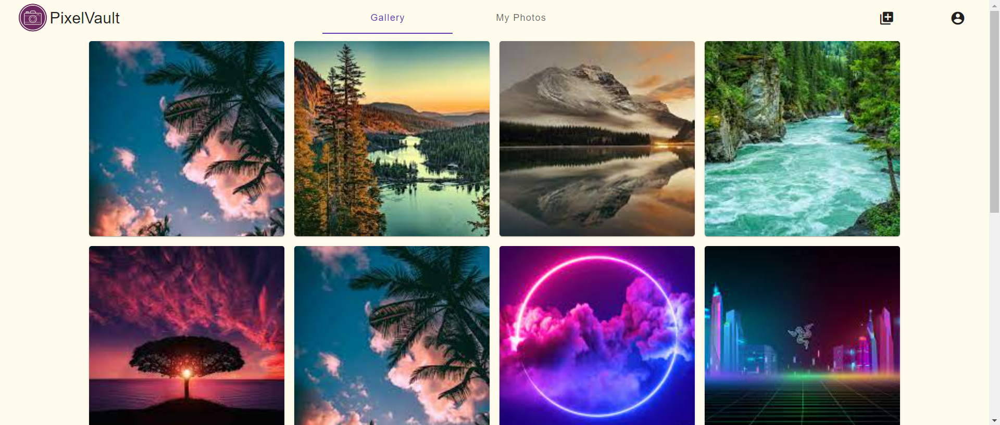

# 

Preserve your memories, share your moments!

This README includes:

- [About PixelVault](#about-pixelvault)
- [What's Next?](#whats-next)
- [Project Setup](#project-setup)

## About PixelVault:



PixelVault is a photo sharing app that allows users to easily upload and share their photos with others. With
PixelVault, users can register for a new account and log in using secure JWT authentication. The app features Angular
Material styling for a sleek and modern design.

Users can add photos to their personal galleries and delete them as needed. Additionally, PixelVault allows users to
view their own gallery, as well as other users' galleries, through the use of link sharing. This feature provides a
convenient way for users to share their photos with others, without needing to individually send them.

In addition to private galleries, PixelVault also includes a public gallery that is accessible to all authenticated
users. This feature allows users to consume and appreciate public content uploaded by other users. The public gallery is
a great way for users to discover new and interesting photos from other PixelVault users.

To ensure user privacy, PixelVault offers both public and private settings for photo sharing. When photos are set to
private, they do not appear in the public gallery and can only be accessed through a direct link. This feature allows
users to share photos with select individuals, without making them visible to the wider community.

Overall, PixelVault is an easy-to-use photo sharing app that prioritizes user privacy and security. Its intuitive
interface and convenient link sharing feature make it a great choice for anyone looking to share their photos with
others in a safe and secure way.

## What's Next?

- User profiles

- Commenting and liking - Interacting with gallery photos

- "Photo of the Day" feature

- Image recognition and search

- Photo collections and albums

- Advanced privacy settings- individual photo visibility

## Project Setup:

This app is built on the MEAN stack - MongoDB, Express, Angular, and Node.js. This README will guide you through the
steps to use the app.

### Prerequisites:

- Node.js installed on your machine
- NPM (Node Package Manager) installed on your machine
- Access to the MongoDB instance in the cloud

### Getting Started:

1. Clone the repository to your local machine: ```https://github.com/tabreeksomani/PixelVault.git```
2. Open a terminal and navigate to the project directory.
3. Add the ```.env``` file to the ```/server``` directory.

### Starting the Server:

1. Navigate to the ```server``` directory in the terminal.
2. Run ```npm install``` to install all the dependencies for the server.
3. Run ```npm start``` to start the server.
4. The server will start running at http://localhost:3000.

### Starting the Client:

1. Navigate to the ```client``` directory in the terminal
2. Run ```npm install``` to install all the dependencies for the client.
3. Run ```npm start``` to start the client.
4. The client will open in your default web browser at http://localhost:4200.

### Connecting to MongoDB:

- The app is set up to use the MongoDB instance in the cloud, which means that you do not need to set up a local MongoDB
  instance. The app will automatically connect to the cloud MongoDB instance upon starting the server.