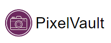

# 

Preserve your memories, share your moments!

## About PixelVault:

PixelVault is a photo sharing app that allows users to easily upload and share their photos with others. With
PixelVault, users can register for a new account and log in using secure JWT authentication. The app features Angular
Material styling for a sleek and modern design.

Users can add photos to their personal galleries and delete them as needed. Additionally, PixelVault allows users to
view their own gallery, as well as other users' galleries, through the use of link sharing. This feature provides a
convenient way for users to share their photos with others, without needing to individually send them.

In addition to private galleries, PixelVault also includes a public gallery that is accessible to all authenticated
users. This feature allows users to consume and appreciate public content uploaded by other users. The public gallery is
a great way for users to discover new and interesting photos from other PixelVault users.

To ensure user privacy, PixelVault offers both public and private settings for photo sharing. When photos are set to
private, they do not appear in the public gallery and can only be accessed through a direct link. This feature allows
users to share photos with select individuals, without making them visible to the wider community.

Overall, PixelVault is an easy-to-use photo sharing app that prioritizes user privacy and security. Its intuitive
interface and convenient link sharing feature make it a great choice for anyone looking to share their photos with
others in a safe and secure way.

## Potential New Features:

- User profiles: Allow users to create and customize their own profiles, which could include a profile picture, bio, and
  links to social media profiles.


- Commenting and liking: Allow users to comment on and like each other's photos, fostering a sense of community within
  the app.


- "Photo of the Day" feature that utilizes upvotes to showcase the most popular and high-quality photo uploaded by users
  on a particular day. This feature would be designed to promote engagement and interaction within the PixelVault
  community, while also providing a fun and exciting way for users to discover new and interesting photos. Photo filters
  and editing: Incorporate photo editing tools and filters to allow users to enhance and customize their
  photos before uploading them.


- Image recognition: Utilize machine learning to automatically tag and categorize photos based on their content, making
  it
  easier for users to search for and discover specific types of photos.


- Advanced privacy settings: Expand on the app's existing privacy settings by allowing users to set permissions for
  individual photos or albums, giving them greater control over who can view their content.

## Project Setup:

This app is built on the MEAN stack - MongoDB, Express, Angular, and Node.js. This README will guide you through the
steps to use the app.

### Prerequisites:

- Node.js installed on your machine
- NPM (Node Package Manager) installed on your machine
- Access to the MongoDB instance in the cloud

### Getting Started:

1. Clone the repository to your local machine: ```https://github.com/tabreeksomani/PixelVault.git```
2. Open a terminal and navigate to the project directory.
3. Run npm install to install all the dependencies for the client and server.

### Starting the Client:

1. Navigate to the "client" directory in the terminal.
2. Run npm start to start the client.
3. The client will open in your default web browser at http://localhost:4200.

### Starting the Server:

1. Navigate to the "server" directory in the terminal.
2. Run npm start to start the server.
3. The server will start running at http://localhost:3000.

### Connecting to MongoDB:

- The app is set up to use the MongoDB instance in the cloud, which means that you do not need to set up a local MongoDB
  instance. The app will automatically connect to the cloud MongoDB instance upon starting the server.